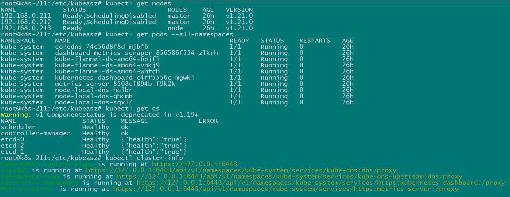

# 使用 [kubeasz](https://github.com/easzlab/kubeasz) 安装 k8s

## 基于二进制方式部署 k8s, 利用 ansible-playbook 实现自动化

### 1.1 高可用架构图


### 1.2 准备三台虚拟机 (2C/4G/30G)

- 192.168.0.211 (master)
- 192.168.0.212 (master)
- 192.168.0.213 (node)

### 1.3 在其中一台 master 节点安装 ansible, 并配置到其他节点免密码登录

#### Ubuntu 18.04 请执行以下命令

```bash
ln -s /usr/bin/python3 /usr/bin/python

# 在其中一个节点安装 ansible (这里在 192.168.0.211 上安装)
apt-get update && apt-get install -y python3-pip

python -m pip install -U pip -i https://mirrors.aliyun.com/pypi/simple/

python -m pip install ansible==2.9.2 -i https://mirrors.aliyun.com/pypi/simple/

# 生成秘钥
ssh-keygen -t rsa -b 2048 -N '' -f ~/.ssh/id_rsa

# 配置免密登录
ssh-copy-id 192.168.0.211
ssh-copy-id 192.168.0.212
ssh-copy-id 192.168.0.213

# 测试连通性
ansible -i "192.168.0.211,192.168.0.212,192.168.0.213" all -m ping
```

### 1.4 克隆 kubeasz 工具

```bash
cd /etc/
git clone https://github.com/easzlab/kubeasz.git
cd kubeasz
git checkout 3.1.0
```

### 1.5 执行脚本下载安装包

```bash
./ezdown -D
```

### 1.6 创建集群 (给集群起个名字)

```bash
./ezctl new k8s-01
```

### 1.7 配置集群节点

#### 根据上一步的提示, 修改配置文件

```bash
# 主要修改下面几项
# vim /etc/kubeasz/clusters/k8s-01/hosts
[etcd]
192.168.0.211
192.168.0.212
192.168.0.213

# master node(s)
[kube_master]
192.168.0.211
192.168.0.212

# work node(s)
[kube_node]
192.168.0.213

# vim /etc/kubeasz/clusters/k8s-01/config.yml
# 我们选择在线安装, 需要的安装包前面已经下载过了。这文件不用修改
```

### 1.8 执行安装命令

```bash
./ezctl setup k8s-01 all
```

### 1.9 验证

```bash
kubectl get nodes
kubectl get pods --all-namespaces
kubectl get cs
kubectl cluster-info
```


