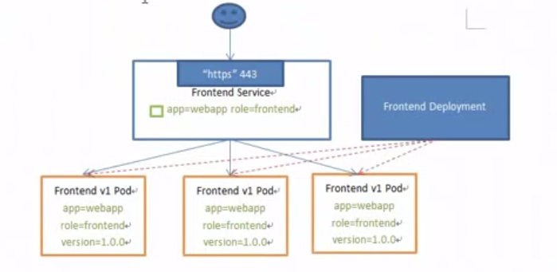
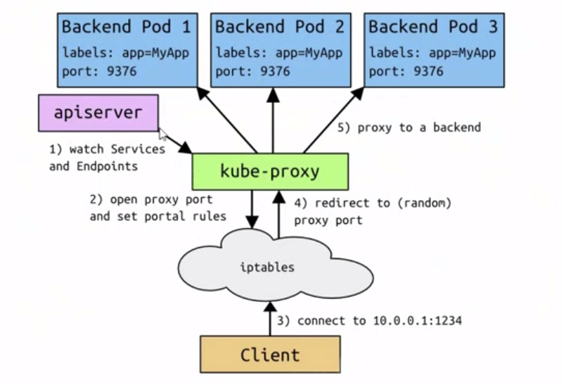
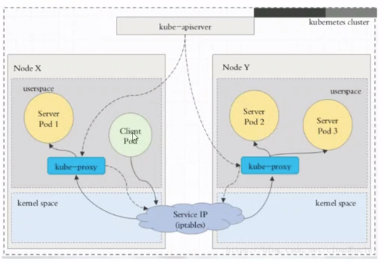
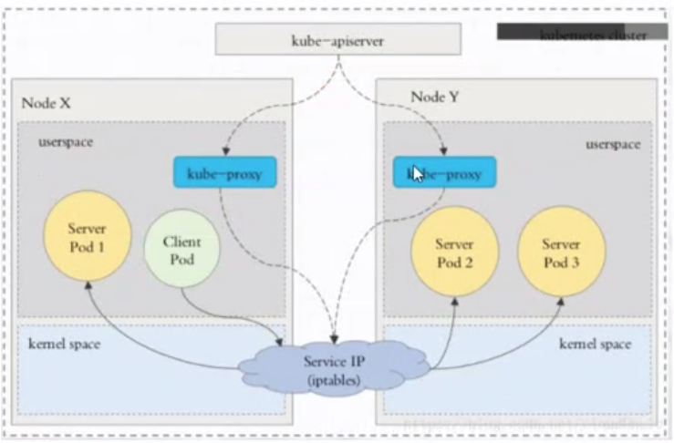
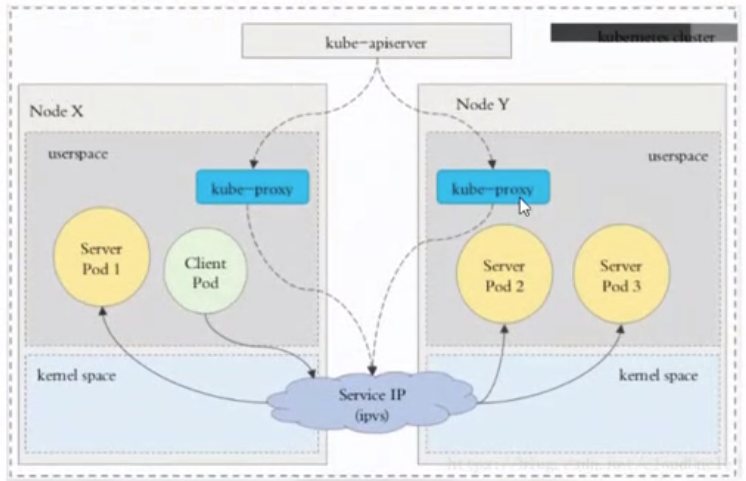

#### Service 的概念
---
###### Kubernetes `Service`定义了这样一种抽象: 一个`Pod`的逻辑分组, 一种可以访问它们的策略 -- 通常成为微服务. 这组`Pod`能够被`Service`访问到, 通常是通过`Label Selector`
  
###### Service 能够提供负载均衡的能力, 但是在使用上有以下限制:
  - 只提供 4 层负载均衡能力, 而没有 7 层功能, 但有时我们可能需要更多的匹配规则来转发请求, 这点上 4 层负载均衡是不支持的

#### Service 的类型
---
###### Service 在 k8s 中有以下四种类型
  - ClusterIp: 默认类型, 自动分配一个仅 Cluster 内部可以访问的虚拟 IP
  - NodePort: 在 ClusterIp 基础上为 Service 在每台机器上绑定一个端口, 这样就可以通过 NodeIP:NodePort 来访问该服务
  - LoadBalancer: 在 NodePort 的基础上, 借助 cloud provider 创建一个外部负载均衡器, 并将请求转发到 NodeIP:NodePort
  - ExternalName: 把集群外部的服务引入到集群内部来, 在集群内部直接使用. 没有任何类型代理被创建, 这只有 kubernetes 1.7 或更高版本的 kube-dns 才支持
    

 #### VIP 和 Service 代理
---
 ###### 在 Kubernetes 集群中, 每个 Node 运行一个`kube-proxy`进程. `kube-proxy`负责为`Service`实现了一种 VIP (虚拟IP) 的形式, 而不是`ExternalName`的形式. 在 Kubernetes v1.0 版本, 代理完全在 userspace. 在 Kubernetes v1.1 版本, 新增了 iptables 代理, 但并不是默认的运行模式. 从 Kubernetes v1.2 起, 默认就是 iptables 代理. 在 Kubernetes v1.8.0-beta.0 中, 添加了 ipvs 代理
 ###### 在 Kubernetes v1.14 版本开始默认使用 ipvs 代理
 ###### 在 Kubernetes v1.0 版本, `Service`是 4 层 (TCP/UDP over IP) 概念. 在 Kubernetes v1.1 版本, 新增了`Ingress`API (beta版), 用来表示 7 层 (HTTP) 服务

 #### 代理模式的分类
---
   - 1. userspace 代理模式
     

   - 2. iptables 代理模式
     

   - 3. ipvs 代理模式
     这种模式, kube-proxy 会监视 Kubernetes `Service`对象和`Endpoints`, 调用`netlink`接口以相应地创建 ipvs 规则并定期与 Kubernetes `Service`对象和`Endpoints`对象同步 ipvs 规则, 以确保 ipvs 状态与期望一致. 访问服务时, 流量将被重定向到其中一个后端 Pod
     与 iptables 类似, ipvs 与 netfilter 的 hook 功能, 但使用哈希表作为底层数据结构并在内核空间中工作. 这样意味着 ipvs 可以更快地重定向流量, 并且在同步代理规则时具有更好的性能. 此外, ipvs 为负载均衡算法提供了更多选项, 例如:
       - `rr`: 轮训调度
       - `lc`: 最小连接数
       - `dh`: 目标哈希
       - `sh`: 源哈希
       - `sed`: 最短期望延迟
       - `nq`: 不排队调度 
     <!-- 注意: ipvs 模式假定在运行 kube-proxy 之前在节点上都已经安装了 IPVS 内核模块. 当 kube-proxy 以 ipvs 代理模式启动时, kube-proxy 将验证节点上是否安装了 IPVS 模块, 如果未安装, 则 kube-proxy 将回退到 iptables 代理模式 -->
     

#### ClusterIP
---
###### ClusterIP 主要在每个 node 节点使用 iptables, 将发向 ClusterIP 对应端口的数据, 转发到 kube-proxy 中, 然后 kube-proxy 自己内部实现有负载均衡的方法, 并可以查询到这个 service 下对应的地址和端口, 进而把数据转发给对应的 pod 的地址和端口
###### 整个过程主要需要以下几个组件协同工作:
  - apiserver 用户通过 kubectl 命令向 apiserver 发送创建 service 的命令, apiserver 接到请求后将数据存储到 etcd 中
  - kube-proxy kubernetes中个每个节点中都有一个叫做 kube-proxy 的进程, 这个进程负责感知 service, pod 的变化, 并将变化的信息写入本地的 iptables 规则中
  - iptables 使用 NAT 等技术将 virtualIP 的流量转发至 endpoint 中

###### 创建 Deployment myapp-deployment.yaml
```yaml
apiVersion: apps/v1
kind: Deployment
metadata:
  name: myapp-deployment
  namespace: default
spec:
  replicas: 3
  selector:
    matchLabels:
      app: myapp
      release: stabel
  template:
    metadata:
      labels:
        app: myapp
        release: stabel
        env: test
    spec:
      containers:
      - name: myapp
        image: harbor.ninejy.io/library/myapp:v2
        imagePullPolicy: IfNotPresent
        ports:
        - name: http
          containerPort: 80
```
###### 创建 Service
```yaml
apiVersion: v1
kind: Service
metadata:
  name: myapp
  namespace: default
spec:
  type: ClusterIP
  selector:
    app: myapp
    release: stabel
  ports:
  - name: http
    port: 80
    targetPort: 80
```

#### Headless Service
---
###### 有时候不需要或不想要负载均衡, 以及单独的 ServiceIP. 遇到这种情况, 可以通过指定 ClusterIP (spec.ClusterIP) 的值为 None 来创建 Headless Service. 这类 Service 并不会分配 ClusterIP, kube-proxy 不会处理它们, 而且平台也不会为他们进行负载均衡和路由
```yaml
apiVersion: v1
kind: Service
metadata:
  name: myapp-headless
  namespace: default
spec:
  selector:
    app: myapp
  clusterIP: "None"
  ports:
  - port: 80
    targetPort: 80
```
```bash
dig -t A myapp-headless.default.svc.cluster.local. @${coredns_ip}
```

#### NodePort
---
###### NodePort 的原理在于在 node 上开了一个端口, 将该端口的流量导入到 kube-proxy, 然后由 kube-proxy 进一步给到对应的 Pod
```yaml
apiVersion: v1
kind: Service
metadata:
  name: myapp
  namespace: default
spec:
  type: NodePort
  selector:
    app: myapp
    release: stabel
  ports:
  - name: http
    port: 80
    targetPort: 80
```

#### LoadBalancer
---
###### LoadBalancer 和 NodePort 其实是一种方式. 区别在于 LoadBalancer 比 NodePort 多了一步, 就是可以调用 cloud provider 去创建 LB 来向节点导流

#### ExternalName
---
###### 这种类型的 Service 通过返回 CNAME 和它的值, 可以将服务映射到 externalName 字段的内容 (例如: harbor.ninejy.io). ExternalName Service 是 Service 的特例, 它没有 selector, 也没有定义任何的端口和 Endpoint. 相反的, 对于运行在集群外部的服务, 它通过返回外部服务的别名这种方式来提供服务
```yaml
apiVersion: v1
kind: Service
metadata:
  name: my-service-1
  namespace: default
spec:
  type: ExternalName
  externalName: harbor.ninejy.io
```
###### 当查询主机 my-service-1.default.svc.cluster.local (SVC_NAME.NAMESPACE.svc.cluster.local) 时, 集群的 DNS 服务将返回一个值 harbor.ninejy.io 的 CNAME 记录. 访问这个服务的方式和其他的相同, 唯一不同的是重定向发生在 DNS 层, 而且不会进行代理或转发
