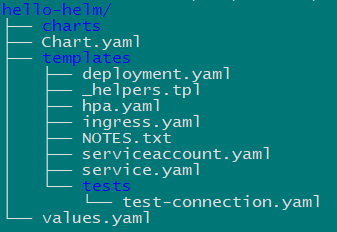
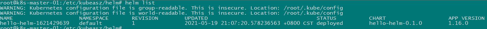

#### Helm3

- 安装 1

```bash
wget https://get.helm.sh/helm-v3.5.4-linux-amd64.tar.gz
tar zxf helm-v3.5.4-linux-amd64.tar.gz
mv helm-v3.5.4-linux-amd64/helm /usr/local/bin/
```

- 安装 2

```bash
curl https://baltocdn.com/helm/signing.asc | sudo apt-key add -
sudo apt-get install apt-transport-https --yes
echo "deb https://baltocdn.com/helm/stable/debian/ all main" | sudo tee /etc/apt/sources.list.d/helm-stable-debian.list
sudo apt-get update
sudo apt-get install helm
```

- 使用

#### helm search

```bash
helm search hub [xxx]
## From Artifact Hub
## https://artifacthub.io/packages/helm/
# helm search hub wordpress

helm search repo [xxx]
## From helm repo add
# helm repo add brigade https://brigadecore.github.io/charts
# helm search repo brigade
# helm search repo kash
```

#### helm install

```bash
helm install happy-panda bitnami/wordpress

# export SERVICE_IP=$(kubectl get svc --namespace default happy-panda-wordpress --template "{{ range (index .status.loadBalancer.ingress 0) }}{{.}}{{ end }}")
# echo "WordPress URL: http://$SERVICE_IP/"
# echo "WordPress Admin URL: http://$SERVICE_IP/admin"
# echo Password: $(kubectl get secret --namespace default happy-panda-wordpress -o jsonpath="{.data.wordpress-password}" | base64 --decode)
helm status happy-panda
```

#### helm create

```bash
helm create hello-helm

tree hello-helm

# 修改文件 hello-helm/values.yaml
#### image.tag, service.type
helm install ./hello-helm --generate-name

helm list

kubectl get deployment,pods,svc

curl http://192.168.0.61:31912

helm package hello-helm

helm delete hello-helm-1621429639
```





