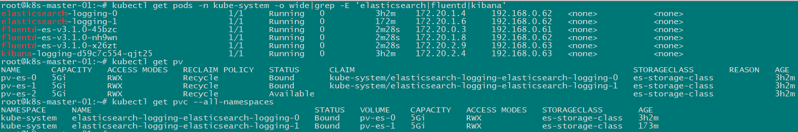
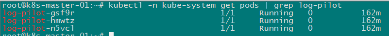
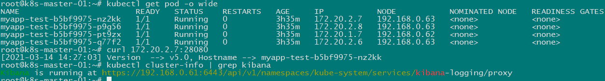
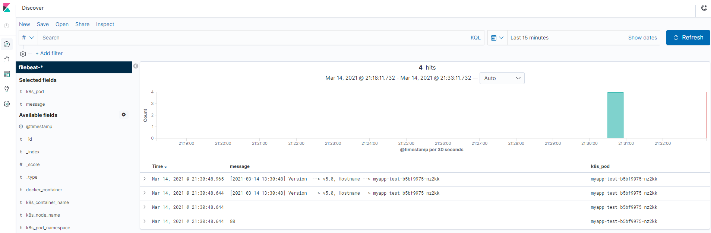

#### 参考 [https://github.com/easzlab/kubeasz/blob/master/docs/guide/efk.md](https://github.com/easzlab/kubeasz/blob/master/docs/guide/efk.md)

- clone 脚本

```bash
git clone https://github.com/easzlab/kubeasz.git
cd kubeasz
git checkout 2.2.3
```

- 修改镜像版本

##### 脚本中默认的 elasticsearch/kibana 是 6.x 版本. 这里我们修改为 7.x 版本

```bash
# manifests/efk/kibana-deployment.yaml
image: registry.cn-shanghai.aliyuncs.com/ninejy/kibana-oss:7.4.2

# manifests/efk/es-static-pv/es-statefulset.yaml
image: registry.cn-shanghai.aliyuncs.com/ninejy/elasticsearch:v7.4.3

# manifests/efk/fluentd-es-ds.yaml
image: registry.cn-shanghai.aliyuncs.com/ninejy/fluentd:v3.1.0
```

- 安装并配置 nfs

```bash
# ubuntu 16.04
apt-get update && apt-get install -y nfs-kernel-server nfs-common

# cat /etc/exports
/data *(insecure,rw,sync,no_root_squash,no_all_squash,no_subtree_check)

# start nfs server
systemctl start nfs-kernel-server.service
```

- 配置 pv

```bash
# cat manifests/efk/es-static-pv/es-pv0.yaml
# IP 根据实际的来写
apiVersion: v1
kind: PersistentVolume
metadata:
  name: pv-es-0
spec:
  capacity:
    storage: 5Gi
  accessModes:
    - ReadWriteMany
  volumeMode: Filesystem
  persistentVolumeReclaimPolicy: Recycle
  storageClassName: "es-storage-class"
  nfs:
    path: /data/es00
    server: 10.31.0.18

# cat manifests/efk/es-static-pv/es-pv1.yaml
apiVersion: v1
kind: PersistentVolume
metadata:
  name: pv-es-1
spec:
  capacity:
    storage: 5Gi
  accessModes:
    - ReadWriteMany
  volumeMode: Filesystem
  persistentVolumeReclaimPolicy: Recycle
  storageClassName: "es-storage-class"
  nfs:
    path: /data/es01
    server: 10.31.0.18

# cat manifests/efk/es-static-pv/es-pv2.yaml
apiVersion: v1
kind: PersistentVolume
metadata:
  name: pv-es-2
spec:
  capacity:
    storage: 5Gi
  accessModes:
    - ReadWriteMany
  volumeMode: Filesystem
  persistentVolumeReclaimPolicy: Recycle
  storageClassName: "es-storage-class"
  nfs:
    path: /data/es02
    server: 10.31.0.18

# create directory
mkdir -p /data/{es00,es01,es02}

# manifests/efk/es-static-pv/es-statefulset.yaml
# 修改 volumeClaimTemplates 下面的 storage 容量, 跟上面创建的 pv 容量保持一致
  volumeClaimTemplates:
  - metadata:
      name: elasticsearch-logging
    spec:
      accessModes: [ "ReadWriteMany" ]
      storageClassName: "es-storage-class"
      resources:
        requests:
          storage: 5Gi
```

- 执行脚本创建 efk

```bash
kubectl apply -f manifests/efk/
kubectl apply -f manifests/efk/es-static-pv/
```

- 验证

```bash
kubectl get pods -n kube-system|grep -E 'elasticsearch|fluentd|kibana'
kubectl get pv
kubectl get pvc --all-namespaces

# 强制删除 pv
# kubectl patch pv pv-name -p '{"metadata":{"finalizers":null}}'
```



---

#### 说明: 这个方案只能搜集容器标准输出的日志, 如果需要搜集文件日志，可以使用阿里云开源的 log-pilot

- 修改镜像, 默认的镜像使用 filebeat-6.x, 这跟 elasticsearch-7.x 不兼容。

```bash
# manifests/efk/log-pilot/log-pilot-filebeat.yaml
image: registry.cn-shanghai.aliyuncs.com/ninejy/log-pilot:0.9.7-filebeat-oss-7.4.2
```

- 执行命令创建 Daemonset

```bash
kubectl apply -f manifests/efk/log-pilot/log-pilot-filebeat.yaml
```

- 验证

```bash
kubectl -n kube-system get pods | grep log-pilot
```



#### 使用示例

```yaml
# myapp-test.yaml
apiVersion: apps/v1
kind: Deployment
metadata:
  name: myapp-test
spec:
  replicas: 3
  selector:
    matchLabels:
      app: myapp-test
  template:
    metadata:
      labels:
        app: myapp-test
    spec:
      containers:
      - name: myapp-container
        image: registry.cn-shanghai.aliyuncs.com/ninejy/hello:v5
        ports:
        - containerPort: 80
        env:
        - name: aliyun_logs_myappStdout
          value: "stdout"
        - name: aliyun_logs_myappFile
          value: "/var/log/app/*.log"
        volumeMounts:
        - name: myapp-log
          mountPath: /var/log/app
      volumes:
      - name: myapp-log
        emptyDir: {}
```

#### 部署测试应用并访问一下刚部署的应用，使生成一些日志

```bash
kubectl apply -f myapp-test.yaml

kubectl get pod -o wide
# myapp-test-b5bf9975-nz2kk   1/1     Running   0          143m   172.20.2.7   192.168.0.63

curl 172.20.2.7:28080
# [2021-03-14 13:30:48] Version  --> v5.0, Hostname --> myapp-test-b5bf9975-nz2kk

# 获取 kibana 访问地址
kubectl cluster-info | grep kibana
```



#### 浏览器打开 kibana 访问地址，创建 'index pattern', 之后就能看到应用的日志已经到 elasticsearch 中了



#### 更多详细的 log-pilot 介绍请参考文档

阿里云介绍文档: [https://help.aliyun.com/document_detail/86552.html](https://help.aliyun.com/document_detail/86552.html)

介绍文档2: [https://yq.aliyun.com/articles/674327](https://yq.aliyun.com/articles/674327)

---

#### 补充：通过 Api-server 访问 kibana (dashboard 一样的)

```bash
# 获取客户端证书, 进行 base64 解码后保存到 kubecfg.crt
grep 'client-certificate-data' ~/.kube/config | head -n 1 | awk '{print $2}' | base64 -d > kubecfg.crt

# 获取客户端公钥, 进行 base64 解码后保存到 kubecfg.key
grep 'client-key-data' ~/.kube/config | head -n 1 | awk '{print $2}' | base64 -d > kubecfg.key

# 提取 kubecfg.crt 和 kubecfg.key 文件内容, 生成 P12 安全证书, 并保存到 kubecfg.p12 文件
openssl pkcs12 -export -clcerts -inkey kubecfg.key -in kubecfg.crt -out kubecfg.p12 -name "kubernetes-client"

# 说明: 生成安全证书时, 需要设置提取密码, 你可以设置自定义密码或设置密码为空

# 将安全证书下载到本地, 以 Windows10 操作系统为例, 证书的安装步骤如下
# 1. 双击证书文件, 弹出证书导入向导对话框, 确定要导入的证书文件
# 2. 输入生成安全证书时设置的自定义密码
# 3. 设置证书保存位置
# 4. 完成证书导入

# kubectl cluster-info | grep kibana # 这条命令获取 kibana 的访问地址
# https://192.168.0.61:6443/api/v1/namespaces/kube-system/services/kibana-logging/proxy
# 浏览器输入上面获取的地址即可访问 kibana
```
