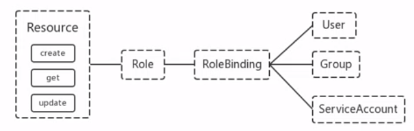

#### Authorization
---
###### 上面认证过程, 只是确认对方通信的双方都确认了对方是可信的, 可以相互通信. 而鉴权是确定请求方有哪些资源的权限. API Server 目前支持以下几种授权策略 (通过 API Server 的启动参数 "--authorization-mode" 设置)
- AlwaysDeny: 表示拒绝所有的请求, 一般用于测试
- AlwaysAllow: 允许接收所有请求, 如果集群不需要授权流程, 则可以采用该策略
- ABAC: (Attribute-Based Access Control): 基于属性的访问控制, 表示使用用户配置的授权规则对用户请求进行匹配和控制
- Webhook: 通过调用外部 REST 服务对用户进行授权
- RBAC (Role-Based Access Control): 基于角色的访问控制, 现行默认规则

#### RBAC 授权模式
---
###### RBAC 基于角色的访问控制, 在 Kubernetes 1.5 中引入, 现行版本成为默认标准. 相对于其它访问控制方式, 拥有以下优势:
- 对集群中的资源和非资源均有完整的覆盖
- 整个 RBAC 完全由几个 API 对象完成, 同其它 API 对象一样, 可以用 kubectl 或 API 进行操作
- 可以在运行时进行调整, 无需重启 API Server

###### 1. RBAC 的 API 资源对象说明
###### RBAC 引入了 4 个新的资源对象: Role、ClusterRole、RoleBinding、ClusterRoleBinding, 4中对象类型均可以通过 kubectl 与 API 操作


###### 需要注意的是 Kubernetes 并不会提供用户管理, 那么 User、Group、ServiceAccount 指定的用户又是从哪里来的呢? kubernetes 组件 (kubectl、kube-proxy) 或是其它自定义的用户在向 CA 申请证书时, 需要提供一个证书文件
```bash
{
    "CN": "admin",
    "hosts": [],
    "key": {
        "algo": "rsa",
        "size": 2048
    },
    "names": [
        {
            "C": "CN",
            "ST": "HangZhou",
            "L": "XS",
            "O": "system:masters",
            "OU": "System"
        }
    ]
}
```
###### API Server 会把客户端证书的`CN`字段作为 User, 把`names.O`字段作为 Group
###### kubelet 使用 TLS Bootstraping 认证时, API Server 可以使用 Bootstap Tokens 或 Token authentication file 验证 =token, 无论哪一种, kubernetes 都会为 token 绑定一个默认的 User 和 Group
###### Pod 使用 ServiceAccount 认证时, service-account-token 中的 JWT 会保存 User 信息
###### 有了用户信息, 再创建一对角色/角色绑定(集群角色/集群角色绑定)资源对象, 就可以完成权限绑定了

#### Role and ClusterRole
---
###### 在 RBAC API 中, Role 表示一组规则权限, 权限只会增加 (累加权限), 不存在一个资源一开始就有很多权限而通过 RBAC 对其进行减少的操作. Role 可以定义在一个 namespace 中, 如果想要跨 namespace 则可以创建 ClusterRole
```yaml
apiVersion: rbac.authorization.k8s.io/v1beta1
kind: Role
metadata:
  name: pod-reader
  namespace: default
rules:
- apiGroups: [""]  # "" indicates the core API group
  resources: ["pods"]
  verbs: ["get", "watch", "list"]
```
###### ClusterRole 具有与 Role 相同的权限角色控制能力, 不同的是 ClusterRole 是集群级别的, ClusterRole 可以用于:
- 集群级别的资源控制 (例如: node 访问权限)
- 非资源型 endpoints (例如: /healthz 访问)
- 所有命名空间资源控制 (例如: pods)

```yaml
apiVersion: rbac.authorization.k8s.io/v1beta1
kind: ClusterRole
metadata:
  name: secret-reader
  namespace: default
rules:
- apiGroups: [""]
  resources: ["secrets"]
  verbs: ["get", "watch", "list"]
```

#### RoleBinding and ClusterRoleBinding
---
###### RoleBinding 可以将角色中定义的权限授予用户或组, RoleBinding 包含一组权限列表(subjects), 权限列表中包含有不同形式的待授予权限资源类型(users, groups, service accounts); RoleBinding 同样包含对被 Bind 的 Role 引用. RoleBinding 适用于某个命名空间内授权, 而 ClusterRoleBinding 适用于集群范围内的授权

###### 将 default 命名空间的`pod-reader`Role 授予 jane 用户, 此后 jane 用户在 default 命名空间中将具有`pod-reader`的权限
```yaml
apiVersion: rbac.authorization.k8s.io/v1beta1
kind: RoleBinding
metadata:
  name: read-pods
  namespace: default
subjects:
- kind: User
  name: jane
  apiGroup: rbac.authorization.k8s.io
roleRef:
  kind: Role
  name: pod-reader
  apiGroup: rbac.authorization.k8s.io
```
###### RoleBinding 同样可以引用 ClusterRole 来对当前 namespace 内用户、用户组或 ServiceAccount 进行授权, 这种操作允许集群管理员在整个集群内定义一些通用的 ClusterRole, 然后在不同的 namespace 中使用

###### 例如: 以下 RoleBinding 引用了一个 ClusterRole, 这个 ClusterRole 具有整个集群内对 secrets 的访问权限; 但是其授权用户`dave`只能访问 development 空间中的 secrets (因为 RoleBinding 定义在 development 命名空间)
```yaml
apiVersion: rbac.authorization.k8s.io/v1beta1
kind: RoleBinding
metadata:
  name: read-secrets
  namespace: development
subjects:
- kind: User
  name: dave
  apiGroup: rbac.authorization.k8s.io
roleRef:
  kind: ClusterRole
  name: secret-reader
  apiGroup: rbac.authorization.k8s.io
```
###### 使用 ClusterRoleBinding 可以对整个集群中的所有命名空间资源进行授权; 以下 ClusterRoleBinding 样例展示了授权 manager 组内所有用户在全部命名空间中对 secrets 进行访问
```yaml
apiVersion: rbac.authorization.k8s.io/v1beta1
kind: ClusterRoleBinding
metadata:
  name: read-secrets-global
subjects:
- kind: Group
  name: manager
  apiGroup: rbac.authorization.k8s.io
RoleRef:
  kind: ClusterRole
  name: secrets-reader
  apiGroup: rbac.authorization.k8s.io
```

#### Resources
---
###### Kubernetes 集群内一些资源一般以其名称字符串来表示, 这些字符串一般会在 API 的 URL 地址中出现; 同时某些资源也会包含子资源, 例如: logs 资源就属于 pods 的子资源, API 中 URL 样例如下
```bash
GET /api/v1/namespaces/{namespace}/pods/{name}/log
```
###### 如果要在 RBAC 授权模型中控制这些子资源的访问权限, 可以通过`/`分隔符来实现, 以下是一个定义 pods 子资源 logs 访问权限的 Role 定义样例
```yaml
apiVersion: rbac.authorization.k8s.io/v1beta1
kind: Role
metadata:
  name: pod-and-pod-logs-reader
  namespace: default
rules:
- apiGroups: [""]
  resources: ["pods", "pods/log"]
  verbs: ["get", "list"]
```

#### to Subjects
---
###### RoleBinding 和 ClusterRoleBinding 可以将 Role 绑定到 Subjects; Subjects 可以是 groups、users 或者service accounts
###### Subjects 中 Users 使用字符串表示, 它可以是一个普通的名字字符串, 也可以是email格式的邮箱地址, 甚至是一组字符串形式的数字. 但是 Users 的前缀 system: 是系统保留的, 集群管理员应该确保普通用户不会使用这个前缀的格式
###### Groups 书写格式与 Users 相同, 都为一个字符串, 并且没有特定的格式要求; 同样 system: 前缀为系统保留

#### 实践1: 创建一个用户只能查看 cka 空间 (基于ServiceAccount)

###### role.yaml
```yaml
apiVersion: rbac.authorization.k8s.io/v1
kind: Role
metadata:
  name: pod-reader
  namespace: cka
rules:
- apiGroups:
  - ""
  resources:
  - pods
  verbs:
  - get
  - list
  - watch
```
###### rolebinding.yaml
```yaml
apiVersion: rbac.authorization.k8s.io/v1
kind: RoleBinding
metadata:
  name: rolebinding-pod-reader
  namespace: cka
roleRef:
  apiGroup: rbac.authorization.k8s.io
  kind: Role
  name: pod-reader
subjects:
- kind: ServiceAccount
  name: pod-reader
  namespace: cka
```

```bash
# 创建 namespace cka
kubectl create namespace cka

# 在 cka 下创建 ServiceAccount
kubectl create serviceaccount pod-reader -n cka

# 在 cka 下创建 Role
kubectl create -f role.yaml

# 在 cka 下创建 RoleBinding
kubectl create -f rolebinding.yaml

# 查看 secret, 从 secret 拿到 token
kubectl get secret -n cka
kubectl get secret pod-reader-token-pd8sd -n cka -o yaml | grep token: | awk '{print $2}' | base64 -d

# 给新用户 ninejy 设置 credentials
kubectl config set-credentials ninejy --token=$(kubectl get secret pod-reader-token-pd8sd -n cka -o yaml | grep token: | awk '{print $2}' | base64 -d)

# 设置 context
kubectl config set-context ninejy --cluster=kubernetes --user=ninejy

# 使用 context
kubectl config use-context ninejy

# 查看 config
kubectl config view

# 执行 `kubectl get pod` 会报错 'Error from server (Forbidden): pods is forbidden', 因为现在用户 ninejy 只能在 cka 空间下查看 pod
kubectl get pod -n cka
```

#### 实践2: 创建一个用户只能管理 dev 空间 (基于证书)
```bash
# cat cert/devuser-csr.json
{
    "CN": "devuser",
    "hosts": [],
    "key": {
        "algo": "rsa",
        "size": 2048
    },
    "names": [
        {
            "C": "CN",
            "ST": "BeiJing",
            "L": "BeiJing",
            "O": "k8s",
            "OU": "System"
        }
    ]
}

# 下载证书生成工具
# https://pkg.cfssl.org/R1.2/cfssl_linux-amd64
# https://pkg.cfssl.org/R1.2/cfssljson_linux-amd64
# https://pkg.cfssl.org/R1.2/cfssl-certinfo_linux-amd64

mv cfssl_1.4.1_linux_amd64 /usr/local/bin/cfssl
mv cfssljson_1.4.1_linux_amd64 /usr/local/bin/cfssljson
mv cfssl-certinfo_1.4.1_linux_amd64 /usr/local/bin/cfssl-certinfo

chmod +x /usr/local/bin/cfssl /usr/local/bin/cfssljson /usr/local/bin/cfssl-certinfo

# 生成证书
cd /etc/kubernetes/pki/
cfssl gencert -ca=ca.crt -ca-key=ca.key -profile=kubernetes \
/root/install-k8s/devuser/cert/devuser-csr.json | cfssljson -bare devuser

# 设置集群参数
export KUBE_APISERVER="https://192.168.0.61:6443"

kubectl config set-cluster kubernetes \
--certificate-authority=/etc/kubernetes/pki/ca.crt \
--embed-certs=true \
--server=${KUBE_APISERVER} \
--kubeconfig=devuser.kubeconfig

# 设置客户端认证参数
kubectl config set-credentials devuser \
--client-certificate=/etc/kubernetes/pki/devuser.pem \
--client-key=/etc/kubernetes/pki/devuser-key.pem \
--embed-certs=true \
--kubeconfig=devuser.kubeconfig

# 设置上下文参数
kubectl config set-context kubernetes \
--cluster=kubernetes \
--user=devuser \
--namespace=dev \
--kubeconfig=devuser.kubeconfig

# 创建 namespace dev
kubectl create namespace dev

# 创建 RoleBinding
kubectl create rolebinding devuser-admin-binding --clusterrole=admin --user=devuser --namespace=dev

useradd -m devuser
cd /home/devuser
mkdir .kube
mv /root/install-k8s/devuser/cert/devuser.kubeconfig .kube/config
chown -R devuser:devuser .kube

# 设置默认上下文
kubectl config use-context kubernetes --kubeconfig=.kube/config

su - devuser
kubectl get pod -n dev
kubectl run nginx --image=harbor.ninejy.io/library/myapp:v1
kubectl get pod -o wide
```
